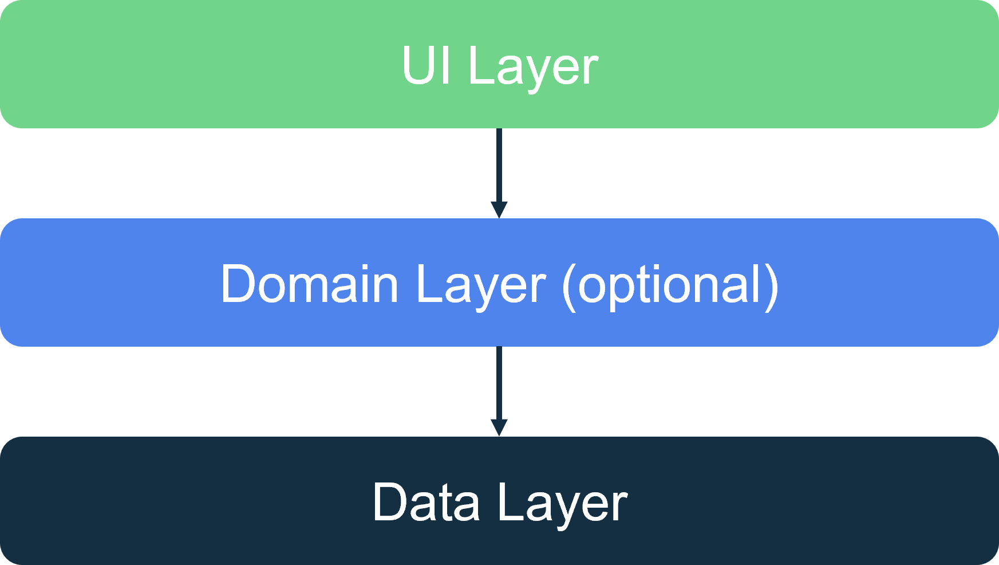
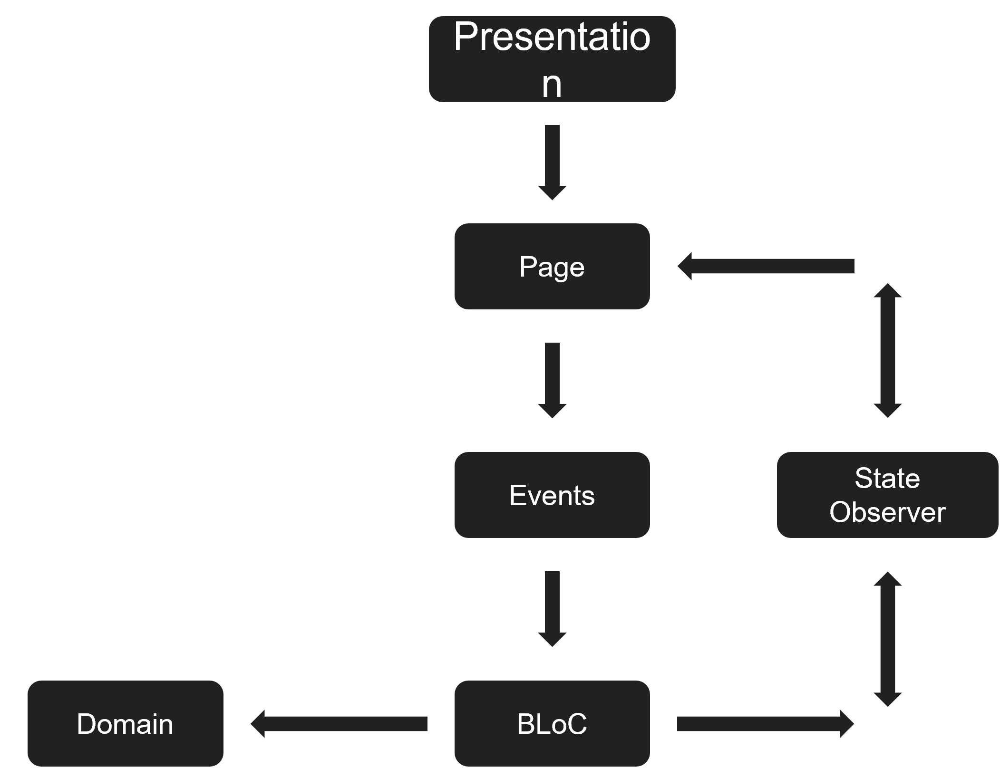
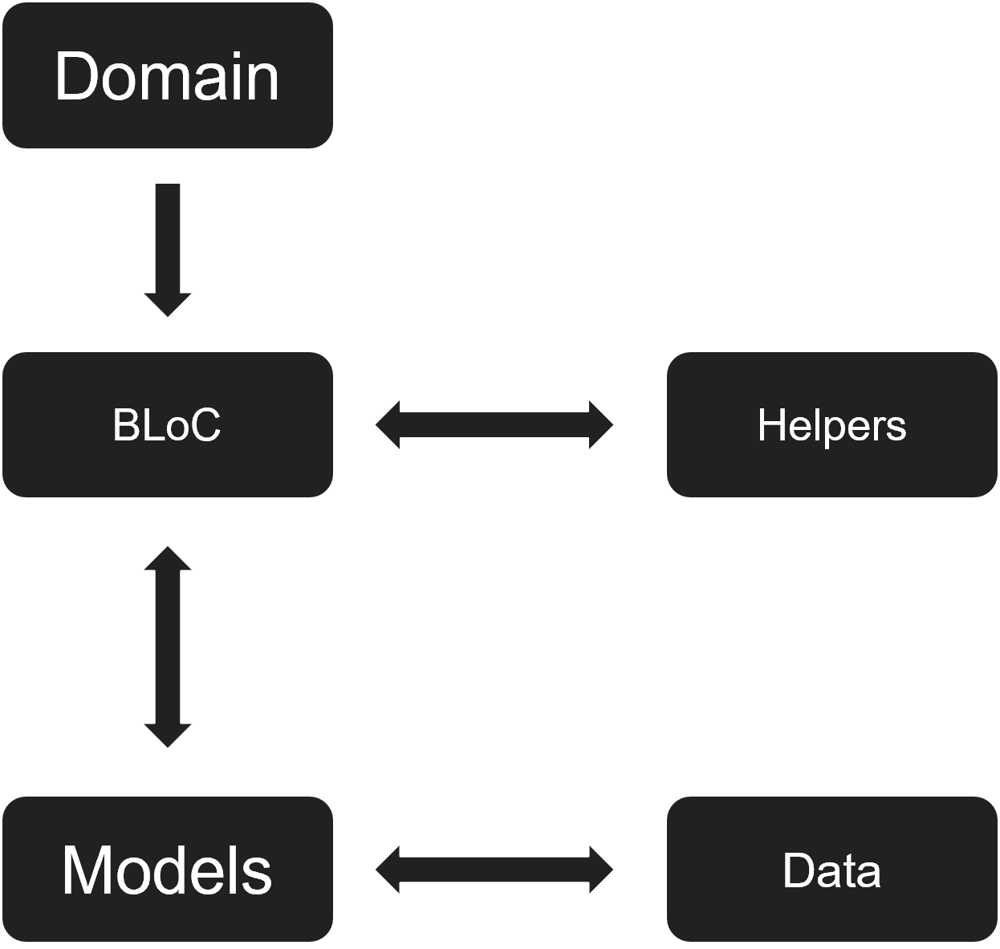
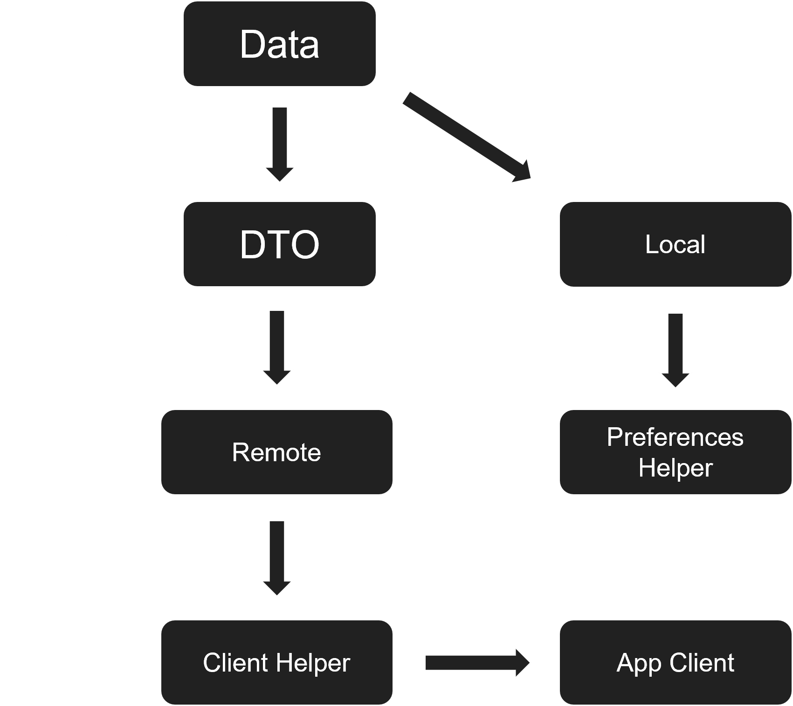
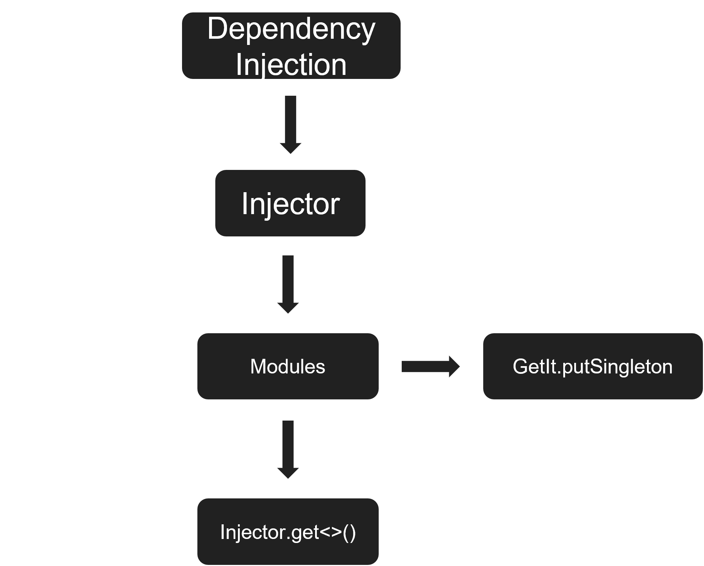

# flutter_base
flutter base project

## Project Structure

```
assets
lib
    app
    base
       - page
       - providers
       - state_management 
    data
        - local
        - remote
        - repositories
    di
        - modules
    domain
        - models
        - repositorries
        - use_cases
    localization
        - delegate
        - strings
    router
        - routes
    ui
        - screen
        - system_design
            - base_widgets
            - themes
    utils
        - constants
        - device
```
___

### assets
* **fonts** => App custom fonts.
* **icons** => App icons (svg format).
* **images** => App images (png format).

### app
* **app.dart** => App widget.
* **main.dart** => Setup dependency injection and run app.

### base
* **page** => base stateless and stateFull pages class.
* **providers** => localization and theme provider.
* **state_management** => base BLoC/State/Event related classes.

### data
* **local** => local data storage.
* **remote** => remote data (api, services...)
* **repositories** => repositories implementation.

### di
* **modules** => App dependencies injection modules.

### domain
* **models** => App model classes.
* **repositories** => Repositories interfaces.
* **use_cases** => Use case classes.

### localization
* **delegate** => Localization delegate.
* **strings** => App static texts (messages).

### router
* **routes** => App routes by context (home route, splash route...).

### ui
* **screens** => App screens (splash, home).
* **system_design** => App base widgets and themes settings.

### utils
* **constants** => App constants values (colors, api constants, dimensions).
* **device** => Devices util functions (get OS type, screen size, keyboard functions...).

___

## Architecture

To follow Flutter documentation and native app development best practices, I chose the MVVM architecture. Think of the BLoC as a ViewModel class.

All logic is placed inside the BLoC (except in some cases, like animations).


## Layers

The software is divided into three main layers:



___

### Presentation
Contains widgets, pages, and UI logic.



___

### Domain
Contains validators, helpers, and all business logic (BLoC classes).



### Data 
Responsible for fetching data (from internal or external sources). Contains repositories, API clients, DTO classes, etc.



___

## Dependency injection

In this app, I created my own Injector class that uses the [GetIt](https://pub.dev/packages/get_it) package to provide class instances following the Singleton pattern.
This makes the dependency injection independent of any external package, since GetIt can easily be replaced by any other dependency injection solution if needed.



___


